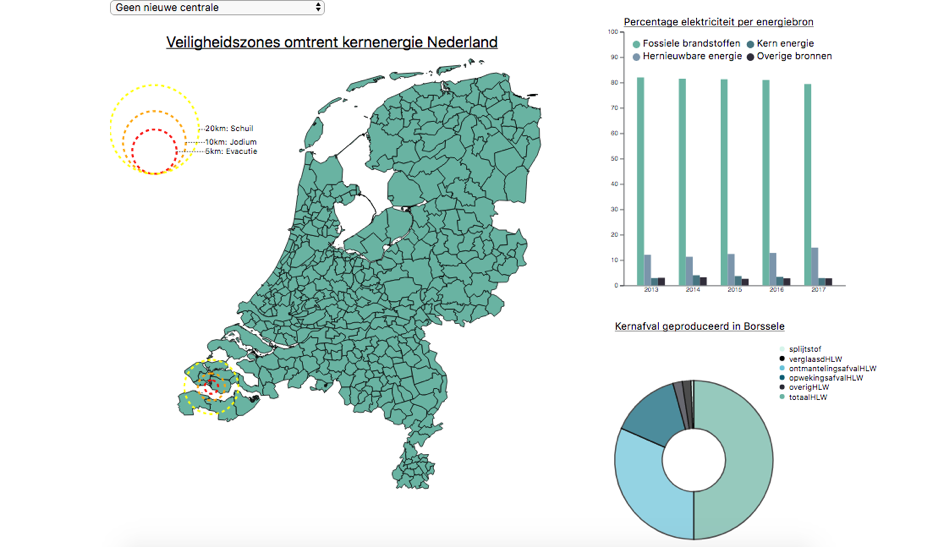

Eindverslag:
================

Door Werther Huzen:

Studentnumber: 12602248

<h2> Introductie:</h2>
In november 2018 werd er door verschillende media gemeld dat de regering met nieuwe plannen voor het bouwen van nieuwe kerncentrales kwam. Deze plannen zijn tot nu toe slechts plannen en zullen niet ter uitvoering worden gebracht. Toch leek het me leuk om een visualisatie te maken waarin scenario's geschets worden ,waarin deze plannen gerealiseerd worden.

Voor twee locaties zijn scenario's bedacht, scenario 1 : één nieuwe centrale op de Maasvlakte ,en scenario 2: één nieuwe centrale op de Maasvlakte en één in Eemshaven. Deze scenario's zijn niet geheel op feiten gebasseerd. Er was maaar weinig data beschikbaar over nieuwe kerncentrales, waardoor de meeste cijfers van het CBS komen, vervolgens is er een onwetenschappelijke schatting gemaakt voor de scenario's.

De kaart geeft weer waar de centrales zich bevinden of zullen bevinden en visualiseert vervolgens de veiligheidszones die volgens de overheid (zouden) gelden. Tevens geeft een barchart de opbrengt aan elektriciteit weer en tenslotte geeft een piechart de hoeveelheid kernafval die bij productie van kernenergie vrijkomt.

Figuur 1: Screenshot van het eindresultaat:

<h2>De volgende visualisaties zijn gemaakt:</h2>

-	Piechart energie:
Totaal aantal geschat radioactief afval dat moet worden opgeslagen wordt weergegeven in meerdere scenario's.
Wanneer er meer centrales worden gebouwd neemt de hoeveelheid kernafval toe. Er is een optie om de huidige hoevelheid kernafval dat opgeslagen is bij COVRA weer te geven, wanneer er dan naar de piechart wordt gewezen wordt de locatie van het COVRA op de map weer gegeven.

-	Kaart risicozones:
Een kaart van Nederland met de veiligheidszones die de overheid heeft opgezet in de omgeving van kerncentrales.
Wanneer er nieuwe centrales worden gebouwd onstaan er ook nieuwe veiligheidszones op de map.

-	Barchart:
Een grouped barchart met de hoeveelheid energie die opgewekt wordt per energiebron. Deze barchart verandert wanneer er extra kerncentrales worden gebouwd. De hoeveelheid energie uit fossiele energiebronnen neemt dan af en de hoeveelheid kernenergie neemt toe. Wanneer je op de barchart wijst met de muis wordt tevens de locatie van centrale weer gegeven.

Hoe de code werkt:
Elke visualisatie krijgt een input mee, waarmee wordt aangegeven welk scenario gevisualiseerd moet worden, Vervolgens wordt de data die nodig is voor de visualisatie meegegeven, samen met een titel en het scenario.
Aan het begin van het programma wordt het senario normaal, meegegeven. Hierdoor worden de normale standaard visualisaties gemaakt. Wanneer er via het menu voor een ander scenario wordt gekozen, krijgt een elke kaart een nieuw scenario als input mee en worden alle kaarten op nieuwe gemaakt.

<h2>Functies:</h2>

<h3>fiterfuncties:</h3>
Er zijn drie filter functies die de data meegegeven aan de kaarten en vervolgens een titel meegeven: filter_map, filter_bar, filter_pie.
Deze filter functies openen de jsonfiles per scenario en roepen dan de functies aan die de visualisaties maken.

<h3>nieuwe_centrale_map:</h3>
Deze functie maakt nieuwe veiligeheidzones aan voor de kaart. Drie cirkels worden er gemaakt in radius om specifiek coördinaten heen en vervolg worden deze cirkels gekoppeld aan de svg van de kaart van de gemeente. Deze functie berekend de radius van de cirkels en geeft de radius weer in coordinaten voor op een kaart.

<h3>kleur_locaties:</h3>
Geeft de kleur weer van de gemeenten waar de kerncentrales zich bevinden. Wanneer dan op de barchart of piechart wordt gewezen, wordt er een nieuwe scenario voor de kaart meegegeven en veranderen de gemeenten met een kercentrale van kleur.

<h3>create_map:</h3>
Maakt een kaart van de gemeenten van Nederland en van de huidige veiligheidszones in Nederland. Een scenario wordt meegegeven als input die de kleur van enkele gemeenten aanpast. Tevens staat de data van de veiligheidszones
in het rijksdriehoekstelsel waardoor deze data eerst omgezet wordt naar GPS coördinaten.

<h3>create_barchart:</h3>
Maakt een grouped barchart aan en een legenda. De barchat verandert van data wanneer een nieuw scenario wordt meegeven. Mouseover geeft de waardes van de verschillende elementen mee.

<h3>create_piechart:</h3>
Maakt een grouped piechart aan en een legenda. De piechat verandert van data wanneer een nieuw scenario wordt meegeven. Er is een specifiek scenario voor de piechart, waarin de totale huidige opslag in de kernopslag van het COVRA wordt weergegeven. Mouseover geeft de waardes van de verschillende elementen mee.

<h2>Moeilijkheden tijdens het project:</h2>

Dit project heeft me veel tijd gekost de afgelopen weken. Ik begon later met data visualisatie doordat ik programeren 2 niet gehaald had.
Ik begon daarom al met project toen ik bij de laatste week van datavisualisatie was.
Hierdoor moest ik enorm opschieten en een inhaalslag doen. Tevens heb ik minder begeleiding bij datavisualisatie gehad en moest ik daardoor harder werken om een goed resultaat neer te zetten.

Tijdens het project had ik grote moeite om een mijn de data te koppelen aan de visualisatie en de visualisaties weer tegeven. Pas in de laatste week leek mijn project ergens op. Ik had beter voor een onderwerp gekozen waarin een grote dataset bruikbaar was voor meerder soorten
visualisaties, maar ik had in mijn hoofd gehaald dat ik iets met kernenergie wilde doen. De visualisaties komen vooral van verschillende databronnen die normaal gesproken weinig met elkaar te maken hebben.

Ook was het moeilijk om de interactie tussen de visualisaties te bedenken, de datasets hadden weinig overlap en schetsten ieder een ander totaal ander beeld. Hierdoor heb ik te vaak gewisseld van plannen en was me vaak niet duidelijk hoe het eind resultaat er uit moest zien.

Tenslotte had ik moeite met het updaten van de datasets zonder de visualisatie compleet te sluiten en had ik niet genoeg tijd om deze functie te schrijven, waardoor de site soms traag is.

<h2>Verschillende versies van het project:</h2>
De basis is het zelfde gebleven: een Kaart van de veiligheidszones, een barchart over het opwekken van elektriciteit en een Piechart over kernafval. Echter heb ik onderwerp van de piechart en de barchart verwisseld. Vooral tussen de interactie tussen de verschillende kaarten is veel veranderd. Ik had steeds geen duidelijkbeeld van het eindproject doordat het erg lang duurde voordat ik de Visualisaties gemaakt kreeg, de data werkte niet mee.
Ik had een idee wat de interactie moest zijn, toch veranderde dit idee constant in mijn hoofd doordat ik geen beeld kreeg van mijn project. Het is in het vervolg dan ook belangrijk dat ik het plan beter uitwerk voordat ik aan de slag ga. Ik had van te voren tevens onvoldoende nagedacht over het design van de webpagina.

Ik heb weinig last gehad van bugs doordat ik constant gebruik heb gemaakt van een soort commando systeem. Elke functie heeft een duidelijke regels gekregen die bepalen wat die functie moet doen onder alle verschillende scenario's. Dit zorgt er voor dat de code duidelijk begrijpbaar is en goed werkt.

Het was lastig om interactie toe te voegen, aangezien meer interactie mogelijk voor een onduidelijkere eindeproduct kan zorgen. Daarom heb ik interactie zo eenvoudig mogelijk gehouden. Er is gekozen voor optie menu waarin gemakkelijk van scenario's kan worden gewisseld, met een duidelijke omschrijving. Met behulp van mouseover is verder een functionaliteit gemaakt waarmee je de specifieke gemeente kan zien waar het scenario zich afspeelt.
Door meer toe te voegen, was ik bang dat het onoverzichtelijk zou worden, aangezien kernenergie een ingwikkeld onderwerp is en de visualisatie, nogal verschillende aspecten van kernenergie beschrijven.
Toch is het eindeproduct duidelijk geworden en vertelt het een duidelijk verhaal.

<h2> Conclusie:</h2>
Dit was een leuk project. Ik heb ontzettend veel geleerd over d3 en javscript.

<h2> Bronnen:</h2>
Maatregel zone Kernenergie van het Nationaal Georegister:
http://servicespub.risicokaart.nl/rk_services_pub/services/WFS-risicokaart?request=GetFeature&service=WFS&version=2.0.0&typeName=veiligheidsafst_kernenergie&outputFormat=application%2Fjson

Eventueel inrichting gevaarlijke stoffen – Faciliteiten voor productie en industrie:
http://nationaalgeoregister.nl/geonetwork/srv/dut/catalog.search#/metadata/8e986f37-74d7-4b6c-8026-87c960456423

Energiebalans: aanbod, omzetting en verbruik:
https://opendata.cbs.nl/statline/#/CBS/nl/dataset/83140NED/table?ts=1559733893093
https://opendata.cbs.nl/#/CBS/nl/dataset/80030ned/table?ts=1559821842391

Kernafval data Piechart:
https://covra.nl/downloads/general/Jaarrapport_COVRA_2018.pdf

Randvoorwaarden voor nieuwe kerncentrales veiligheidszones:
https://www.kernenergieinnederland.nl/files/20060929-randvoorwaarden.pdf
